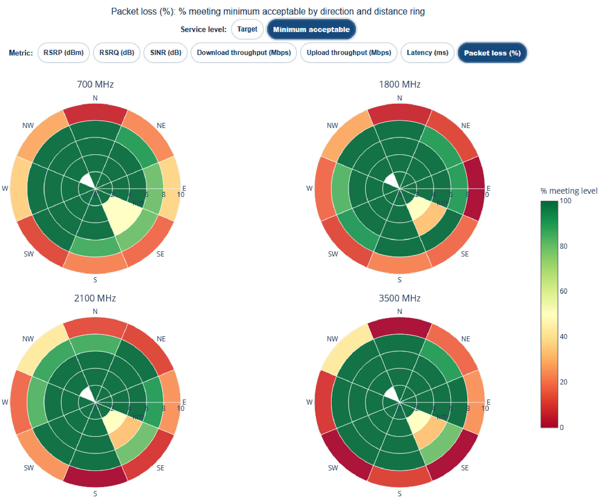
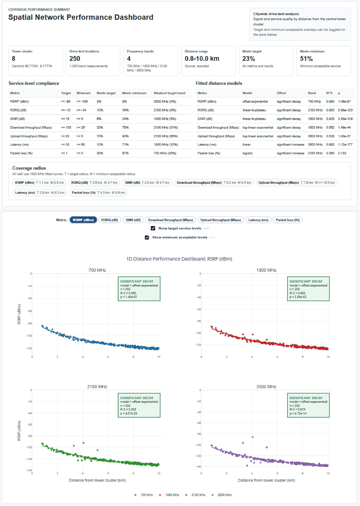
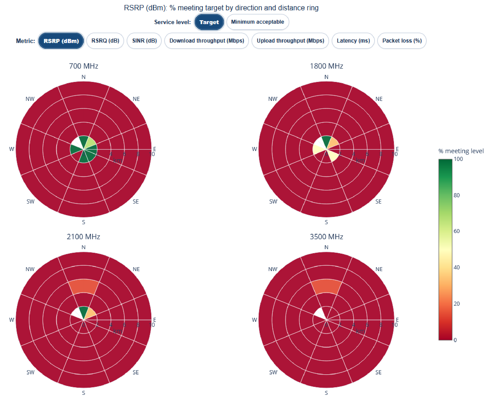

# Spatial Network Performance Dashboards

Interactive dashboards for analysing, visualising and communicating spatial network performance.

This project demonstrates how complex telecommunications measurements can be transformed into intuitive, interactive decision-support dashboards. The emphasis is on communicating analytical insights through intuitive visualisations that support engineering decision making.

Using a realistic synthetic cellular drive-test survey, the dashboards enable users to explore network coverage, service quality and performance across multiple frequency bands through an interactive web interface. The application is designed to resemble the type of analytical reporting tool that could support network optimisation activities within a telecommunications organisation.

---

# Live Demo

Explore multiple performance metrics, compare frequency bands and evaluate service targets directly within your browser. The dashboards are published using **GitHub Pages** and can be explored directly in a web browser.

**Live application:**
**https://michael-slota.github.io/spatial-network-performance-dashboards/**

No installation or Python environment is required.



---

# Portfolio Context

This repository forms part of my data science and analytics portfolio.

Its purpose is to demonstrate my ability to communicate technical analyses through interactive visualisations rather than to showcase software engineering or data-processing workflows. The underlying data preparation and modelling were completed separately; this repository focuses on the final analytical application that would typically be delivered to decision makers.

---

# Project Overview

Modern telecommunications networks generate large volumes of spatial performance data that can be difficult to interpret using traditional reports or spreadsheets.

This project demonstrates how interactive dashboards can be used to:

* explore network performance spatially,
* compare multiple radio-frequency bands,
* evaluate service-level compliance,
* identify coverage gaps,
* communicate engineering insights through intuitive visualisations.

The synthetic network represents a city served by eight 5G macro-cell towers with measurements collected throughout the surrounding area.

The simulated environment includes:

* eight central macro-cell towers,
* four operating frequency bands,
* a directional repeater improving higher-frequency performance,
* a localised dead zone,
* realistic distance-dependent propagation,
* correlated spatial variation,
* measurement noise,
* multiple network performance metrics.

---

# Network Performance Metrics

Each measurement contains the following indicators.

| Metric                  | Description                                         |
| ----------------------- | --------------------------------------------------- |
| **RSRP**                | Reference Signal Received Power (coverage strength) |
| **RSRQ**                | Reference Signal Received Quality                   |
| **SINR**                | Signal-to-Interference-plus-Noise Ratio             |
| **Download Throughput** | User download performance                           |
| **Upload Throughput**   | User upload performance                             |
| **Latency**             | Network response time                               |
| **Packet Loss**         | Reliability of packet delivery                      |

---

# Key Questions Answered

The dashboards are designed to support questions such as:

* Where does network performance fall below service targets?
* Which frequency bands provide the best coverage?
* Which directions from the network centre perform best?
* Where are the likely coverage gaps?
* Which metrics have the greatest impact on user experience?
* How does network performance change with distance?
* Which areas would benefit most from additional infrastructure?

---

# Dashboard Preview

## Distance Performance Dashboard



The distance dashboard explores how each performance metric changes as measurements move away from the central tower cluster. Interactive controls allow users to compare frequency bands, evaluate service targets and estimate coverage limits.

---

## Directional Coverage Dashboard



The directional dashboard summarises network performance using polar sectors and distance rings, highlighting directional trends and areas requiring further investigation.

---

# Dashboard Features

The dashboard suite includes:

* Interactive Plotly visualisations
* Frequency-band comparison
* Distance-decay analysis
* Directional performance analysis
* Service-target evaluation
* Interactive filtering
* Hover tooltips
* Summary statistics
* Coverage estimation
* Standalone HTML deployment

---

# Service Targets

The dashboards compare every measurement against predefined engineering targets.

## Target Performance

| Metric              | Target     |
| ------------------- | ---------- |
| RSRP                | ≥ -95 dBm  |
| RSRQ                | ≥ -10 dB   |
| SINR                | ≥ 15 dB    |
| Download Throughput | ≥ 100 Mbps |
| Upload Throughput   | ≥ 20 Mbps  |
| Latency             | ≤ 30 ms    |
| Packet Loss         | ≤ 1%       |

## Minimum Acceptable Performance

| Metric              | Threshold  |
| ------------------- | ---------- |
| RSRP                | ≥ -105 dBm |
| RSRQ                | ≥ -14 dB   |
| SINR                | ≥ 5 dB     |
| Download Throughput | ≥ 25 Mbps  |
| Upload Throughput   | ≥ 5 Mbps   |
| Latency             | ≤ 60 ms    |
| Packet Loss         | ≤ 3%       |

These thresholds allow the dashboards to estimate service compliance across both distance and direction.

---

# Dashboard Design Principles

The dashboards were designed with stakeholder communication in mind.

Design principles include:

* Simple, uncluttered layouts
* Consistent colour palettes
* Progressive disclosure of information
* Interactive exploration
* Service-target overlays
* Executive summary statistics
* Clear visual hierarchy
* Standalone browser-based deployment

---

# Repository Structure

```text
index.html
data/
    dashboards/
    supporting/
images/
README.md
```

---

# Analytical Workflow

```text
Synthetic network measurements
          ↓
Quality assurance
          ↓
Spatial analysis
          ↓
Service target evaluation
          ↓
Coverage estimation
          ↓
Interactive Plotly dashboards
          ↓
GitHub Pages deployment
```

Although this repository focuses on the finished dashboards, every visualisation originates from a single reproducible analytical workflow to ensure consistency across the application.

---

# Technologies

* Python
* pandas
* NumPy
* SciPy
* Plotly
* HTML
* GitHub Pages

The dashboards are exported as standalone HTML applications and execute entirely within the browser.

---

# Intended Audience

This application is designed for:

* Telecommunications engineers
* Network optimisation teams
* Technical managers
* Project stakeholders
* Clients requiring accessible performance summaries

---

# Limitations

The measurements used throughout this project are synthetic but were designed to resemble realistic cellular drive-test surveys. The emphasis is therefore on demonstrating analytical techniques, spatial visualisation and stakeholder communication rather than representing an operational mobile network.

---

# Portfolio Purpose

This project demonstrates my ability to transform complex technical analyses into clear, interactive decision-support tools.

Rather than emphasising software implementation, the repository focuses on communicating analytical insights through intuitive visualisations that support evidence-based engineering decisions.

The project showcases:

* Interactive dashboard development
* Data visualisation
* Spatial analytics
* Performance monitoring
* Statistical interpretation
* Stakeholder-focused reporting
* Technical communication
* Decision-support design